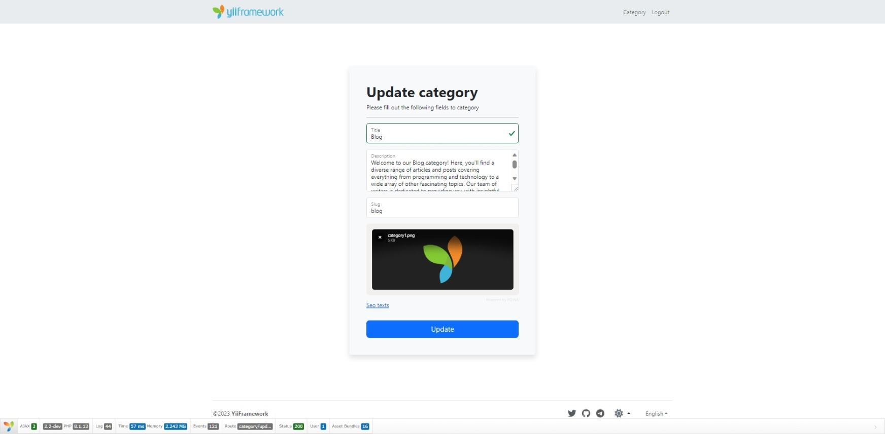

<p align="center">
    <a href="https://github.com/yii2-extensions/filepond" target="_blank">
        
    </a>
    <h1 align="center">FilePond.</h1>
    <br>
</p>

<p align="center">
    <a href="https://www.php.net/releases/8.1/en.php" target="_blank">
        
    </a>  
    <a href="https://github.com/yii2-extensions/filepond/actions/workflows/build.yml" target="_blank">
        
    </a>
    <a href="https://github.com/yii2-extensions/filepond/actions/workflows/compatibility.yml" target="_blank">
        
    </a>    
    <a href="https://codecov.io/gh/yii2-extensions/filepond" target="_blank">
        
    </a>   
    <a href="https://dashboard.stryker-mutator.io/reports/github.com/yii2-extensions/filepond/main" target="_blank">
        
    </a>       
</p>



## Installation

The preferred way to install this extension is through [composer](https://getcomposer.org/download/).

Either run

```
composer require --dev --prefer-dist yii2-extensions/filepond
```

or add

```
"yii2-extensions/filepond": "dev-main"
```

to the require-dev section of your `composer.json` file.

## Usage

### Name

```php
use Yii2\Extensions\Filepond\FilePond;

echo FilePond::widget(['name' => 'image_file']);
```

### Active Field 

```php
use Yii2\Extensions\Filepond\FilePond;

echo $form
    ->field($formModel, 'image_file')
    ->widget(
        FilePond::class,
        [
            'loadFileDefault' => $imageFile,
            'imagePreviewHeight' => 170,
            'imageCropAspectRatio' => '1:1',
        ],
    );
```

### Controller or Model

```php
use Yii2\Extensions\Filepond\FileProcessing;

$imageFile = FileProcessing::saveWithReturningFile(
    $categoryForm->image_file,
    Yii::getAlias('@uploads'),
    "category{$category->id}",
    false
);        
```

### Properties of the widget

| Property                                | Type          | Description                                                                | Default                                 |
|-----------------------------------------|---------------|----------------------------------------------------------------------------|-----------------------------------------|
| `acceptedFileTypes`                     | `string`      | The accepted file types. Can be mime types or wild cards.                  | `[]`                                    |
| `allowFileTypeValidation`               | `bool`        | Whether to allow file type validation.                                     | `true`                                  |
| `allowFileRename`                       | `bool`        | Whether to allow file rename.                                              | `false`                                 |
| `allowFileValidateSize`                 | `bool`        | Whether to allow file size validation.                                     | `true`                                  |
| `allowImageCrop`                        | `bool`        | Whether to allow image crop.                                               | `false`                                 |
| `allowImageExifOrientation`             | `bool`        | Whether to allow image exif orientation.                                   | `true`                                  |   
| `allowImagePreview`                     | `bool`        | Whether to allow image preview.                                            | `true`                                  |
| `allowImageTransform`                   | `bool`        | Whether to allow image transform.                                          | `false`                                 |
| `allowMultiple`                         | `bool`        | Whether to allow multiple files.                                           | `false`                                 |
| `allowpdfPreview`                       | `bool`        | Whether to allow pdf preview.                                              | `false`                                 |
| `cssClass`                              | `string`      | The css class of the widget.                                               | `''`                                    |
| `cdn`                                   | `boolean`     | Whether to use the CDN.                                                    | `true`                                  |
| `config`                                | `array`       | The config of the widget.                                                  | `[]`                                    |
| `fileRename`                            | `string`      | The file rename.                                                           | `''`                                    |
|                                         |               | use: `fileRenameFunction: (file) => return `my_new_name${file.extension}`; |                                         |
| `fileValidateTypeDetectType`            | `string`      | The file validate type detect type function.                               | `''`                                    |
| `fileValidateTypeLabelExpectedTypes`    | `string`      | The file validate type label expected types.                               | `''`                                    |
| `imageCropAspectRatio`                  | `string|null` | The image crop aspect ratio.                                               | `null`                                  |
| `imagePreviewHeight`                    | `string|null` | The image preview height.                                                  | `null`                                  |
| `imagePreviewMarkupShow`                | `bool`        | Whether to show the image preview markup.                                  | `true`                                  |
| `imagePreviewMaxFileSize`               | `string|null` | The image preview max file size.                                           | `null`                                  |
| `imagePreviewMaxHeight`                 | `int`         | The image preview max height.                                              | `256`                                   |
| `imagePreviewMaxInstantPreviewFileSize` | `int`         | The image preview max instant preview file size.                           | `10000000`                              |
| `imagePreviewMinHeight`                 | `int`         | The image preview min height.                                              | `44`                                    |
| `imagePreviewTransparencyIndicator`     | `string!null` | The image preview transparency indicator.                                  | `null`                                  |
| `imageTransformAfterCreateBlob`         | `array|null`  | The image transform after create blob.                                     | `null`                                  |
| `imageTransformBeforeCreateBlob`        | `array|null`  | The image transform before create blob.                                    | `null`                                  |
| `imageTransformOutputQuality`           | `int|null`    | The image transform output quality.                                        | `null`                                  |
| `imageTransformClientTransforms`        | `array|null`  | The image transform client transforms.                                     | `null`                                  |
| `imageTransformOutputQualityMode`       | `string|null` | The image transform output quality mode.                                   | `añways`                                |
| `imageTransformOutputStripImageHead`    | `bool`        | The image transform output strip image head.                               | `true`                                  |
| `imageTransformVariants`                | `array|null`  | The image transform variants.                                              | `null`                                  |
| `imageTransformVariantsIncludeDefault`  | `bool`        | The image transform variants include default.                              | `true`                                  |
| `imageTransformVariantsDefaultName`     | `string|null` | The image transform variants default name.                                 | `null`                                  |
| `imageTransformVariantsIncludeOriginal` | `bool`        | The image transform variants include original.                             | `false`                                 |
| `labelIdle`                             | `string`      | The label idle.                                                            | `''`                                    |
| `labelMaxFileSize`                      | `string`      | The label max file size.                                                   | `''`                                    |    
| `labelMaxFileSizeExceeded`              | `string`      | The label max file size exceeded.                                          | `''`                                    |
| `labelMaxTotalFileSize`                 | `string`      | The label max total file size.                                             | `''`                                    |
| `labelMaxTotalFileSizeExceeded`         | `string`      | The label max total file size exceeded.                                    | `''`                                    |
| `labelFileTypeNotAllowed`               | `string`      | The label file type not allowed.                                           | `''`                                    |
| `loadFileDefault`                       | `string`      | The load file default.                                                     | `''`                                    |
| `maxFiles`                              | `int`         | The max files.                                                             | `1`                                     |
| `maxFileSize`                           | `string|null` | The max file size.                                                         | `null`                                  |
| `maxTotalFileSize`                      | `string|null` | The max total file size.                                                   | `null`                                  |
| `minFileSize`                           | `string|null` | The min file size.                                                         | `null`                                  |
| `pluginDefault`                         | `array`       | The plugins default.                                                       | `[`                                     |  
|                                         |               |                                                                            |   `FilePondPluginFileValidateType,`     |
|                                         |               |                                                                            |   `FilePondPluginFileValidateSize,`     |
|                                         |               |                                                                            |   `FilePondPluginFileValidateType,`     |
|                                         |               |                                                                            |   `FilePondPluginImageExifOrientation,` |
|                                         |               |                                                                            |   `FilePondPluginImagePreview,`         |
|                                         |               |                                                                            | `]`                                     |
| `pdfPreviewHeight`                      | `int`         | The pdf preview height.                                                    | `320`                                   |
| `pdfComponentExtraParams`               | `string`      | The pdf component extra params.                                            | `toolbar=0&view=fit&page=1`             |
| `required`                              | `bool`        | Whether the field is required.                                             | `false`                                 |

### Translation support

The extension supports translation. You can translate the extension into your language,
for default the extension supports the following languages:

- Chinese
- English
- French
- German
- Poland
- Portuguese
- Russian
- Spanish

## Quality code

[](https://github.com/yii2-extensions/filepond/actions/workflows/static.yml)
[](https://github.com/yii2-extensions/filepond/actions/workflows/static.yml)
[](https://github.styleci.io/repos/719070630?branch=main)

## Support versions Yii2

[](https://github.com/yiisoft/yii2/tree/2.0.49.3)
[](https://github.com/yiisoft/yii2/tree/2.2)

## Testing

[Check the documentation testing](/docs/testing.md) to learn about testing.

## Our social networks

[](https://twitter.com/Terabytesoftw)

## License

The MIT License. Please see [License File](LICENSE.md) for more information.
