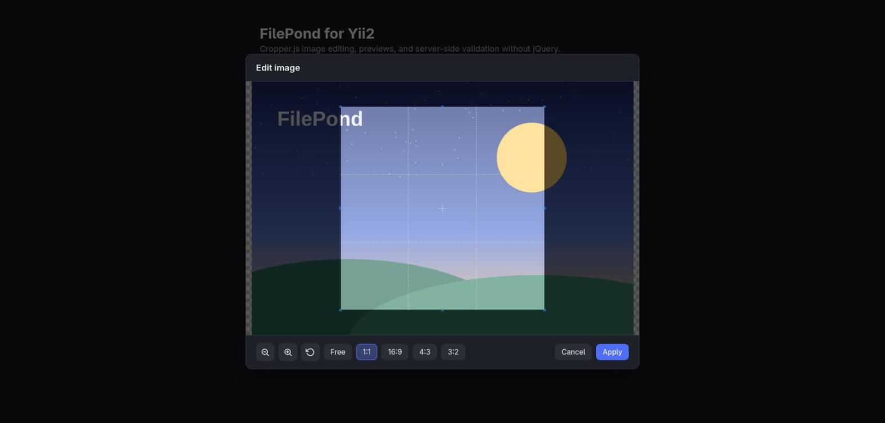

<!-- markdownlint-disable MD041 -->
<p align="center">
    <picture>
        <source media="(prefers-color-scheme: dark)" srcset="https://www.yiiframework.com/image/design/logo/yii3_full_for_dark.svg">
        <source media="(prefers-color-scheme: light)" srcset="https://www.yiiframework.com/image/design/logo/yii3_full_for_light.svg">
        
    </picture>
    <h1 align="center">FilePond</h1>
    <br>
</p>
<!-- markdownlint-enable MD041 -->

<p align="center">
    <a href="https://github.com/yii2-extensions/filepond/actions/workflows/build.yml" target="_blank">
        
    </a>
    <a href="https://dashboard.stryker-mutator.io/reports/github.com/yii2-extensions/filepond/main" target="_blank">
        
    </a>
    <a href="https://github.com/yii2-extensions/filepond/actions/workflows/static.yml" target="_blank">
        
    </a>
    <a href="https://github.com/yii2-extensions/filepond/actions/workflows/security.yml" target="_blank">
        
    </a>
</p>

<p align="center">
    <strong>FilePond file uploads for Yii2 forms</strong><br>
    <em>Cropper.js image editing, previews, client and server validation, no jQuery</em>
</p>



## Features

- **One widget, eleven plugins.** Every `allow*` flag registers the FilePond plugin and publishes its asset bundle;
  nothing else is loaded.
- **Image editing.** Cropper.js 2 in a native dialog with aspect ratio presets, zoom, and reset. The crop is stored
  as FilePond metadata, so the Image Transform plugin, the preview, and the server see the same rectangle.
- **Server-side helpers.** `EncodedFile` decodes File Encode payloads, `FileSaver` stores them with sanitized
  names, `ImageCropper` applies the crop with GD, and `EncodedFileValidator` checks the real MIME type and size.
- **Modern delivery.** Frontend packages come from `node_modules` through [`php-forge/foxy`](https://github.com/php-forge/foxy),
  locally or from a CDN pinned to the installed versions.
- **Localized.** Labels ship in nine languages and register automatically through the extension bootstrap.

## Quick start

### Installation

Requires PHP 8.3 or newer and Yii2 `2.0.54` or `22.x`.

```bash
composer config allow-plugins.php-forge/foxy true
composer require php-forge/foxy:^0.3 yii2-extensions/filepond
```

Yii2 `2.0.x` applications must point the `@npm` alias to `@app/node_modules`; see the
[installation guide](docs/installation.md).

### Basic usage

```php
use yii2\extensions\filepond\FilePond;

echo $form->field($model, 'avatar')->widget(
    FilePond::class,
    [
        'acceptedFileTypes' => ['image/*'],
        'allowImageEdit' => true,
        'allowImageTransform' => true,
        'imageCropAspectRatio' => '1:1',
        'maxFileSize' => '2MB',
    ],
);
```

```php
use yii2\extensions\filepond\file\{EncodedFile, FileSaver};
use yii2\extensions\filepond\validator\EncodedFileValidator;

// Model rules.
[['avatar'], EncodedFileValidator::class, 'mimeTypes' => ['image/*'], 'maxSize' => 2 * 1024 * 1024];

// Controller.
foreach (EncodedFile::fromInput($model->avatar) as $file) {
    (new FileSaver('@webroot/uploads'))->save($file, "user-{$model->id}");
}
```

## Documentation

For detailed configuration options and advanced usage.

- 📚 [Installation Guide](docs/installation.md)
- ⚙️ [Configuration Reference](docs/configuration.md)
- 💡 [Usage Examples](docs/examples.md)
- 🧪 [Testing Guide](docs/testing.md)

## Package information

[](https://www.php.net/releases/8.3/en.php)
[](https://github.com/yiisoft/yii2/tree/master)
[](https://github.com/yiisoft/yii2/tree/22.0)
[](https://packagist.org/packages/yii2-extensions/filepond)
[](https://packagist.org/packages/yii2-extensions/filepond)

## Project status

[](https://codecov.io/github/yii2-extensions/filepond)
[](https://github.com/yii2-extensions/filepond/actions/workflows/static.yml)
[](https://github.com/yii2-extensions/filepond/actions/workflows/quality.yml)
[](https://github.styleci.io/repos/719070630?branch=main)

## Our social networks

[](https://x.com/Terabytesoftw)

## License

[](LICENSE)
